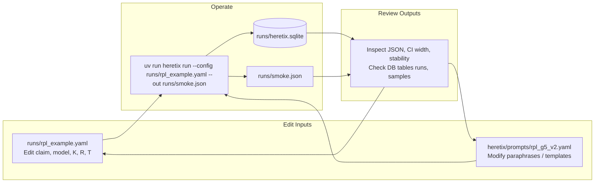

# Elon System Flow Map

## Iteration Tips
- **Tighten confidence intervals:** Increase `K`, `R`, or `T` in `runs/rpl_example.yaml`.
- **Improve paraphrase balance:** Adjust templates in `heretix/prompts/rpl_g5_v2.yaml`.
- **Reuse cached samples:** Leave `runs/heretix.sqlite` intact between runs.
- **Track changes:** Commit edited config/prompt files alongside output JSON for auditability.

Example loop:
1. Edit `runs/rpl_example.yaml` to tweak `K` and `R`.
2. Run `uv run heretix run --config runs/rpl_example.yaml --mock --out runs/smoke.json`.
3. Review `runs/smoke.json` and `runs/heretix.sqlite`.
4. Repeat until CI width and stability meet targets.
